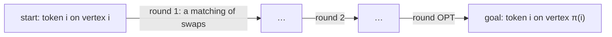
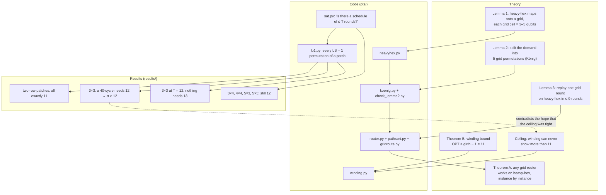
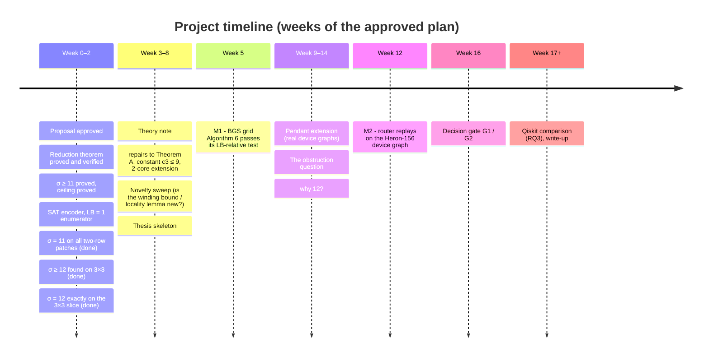

# Research Roadmap

*The one page to read before touching anything. Updated 2026-09-26.*

This is the map of the project: what we are trying to find out, what we
already know, what each result means, and what is still open, so that any
team member can pick a piece and work on it alone. The two long documents
(`REFINED_PROPOSAL.md` for the full argument, `REVIEW.md` for the audit trail)
have every detail; this page has the shape.

---

## 1. The problem in one picture

A quantum chip is a graph: qubits are vertices, and two qubits can interact
only if they are joined by an edge. To run a circuit, qubits constantly have
to be moved next to each other, and the only move available is a **SWAP**
across an edge. Many swaps can happen in the same time step as long as no
qubit is involved in two of them. So a time step is a **matching**, and the
question is:

> Given where every qubit starts and where it must end, how many time steps
> are needed?

That number is `OPT`. Time steps cost decoherence, so fewer is better. This
problem is **parallel token swapping (PTS)**: tokens on vertices, swap along
edges, one matching per round.

Two numbers are always compared:

| symbol | meaning | why it matters |
|---|---|---|
| `LB` | the farthest any single token has to travel (in edges) | trivial lower bound: you cannot beat the longest walk |
| `OPT` | the true minimum number of rounds | what we actually want, and hard to compute |
| `σ` (sigma) | the worst ratio `OPT / LB` over all permutations of a graph family | the **stretch factor**: how badly the easy number can lie |

If `σ` is a constant, the easy number is a good estimate, and simple routers
are near-optimal. If `σ` grows with the chip, it isn't, and routing needs
smarter tools. **Our chip family is IBM's heavy-hex lattice**, the layout of
the Heron processors (133 and 156 qubits).

---

## 2. Where we stand, in one table

| claim | status | evidence |
|---|---|---|
| Heavy-hex PTS reduces to grid PTS, *instance by instance* (Theorem A) | **PROVED** + machine-checked | `pts/router.py`, suite section "Section 4 algorithm" |
| Rotating a hexagon costs 11 rounds while every token moves 1 step, so `σ ≥ 11` (Theorem B) | **PROVED** | winding argument, `pts/winding.py` |
| No winding argument can ever show more than 11 on heavy-hex (the ceiling) | **PROVED** | planar cycle-space argument |
| On every patch with **two rows** of hexagons, `σ = 11` exactly over all `LB = 1` permutations | **VERIFIED** (104,254 SAT instances) | `results/lb1_*.jsonl` |
| On the **3×3 patch** a 40-cycle rotation costs **12**: `σ ≥ 12`, the conjecture `σ = 11` is **false** | **VERIFIED** (two solvers + a replayed schedule) | suite section "Witness" |
| On the 3×3 patch nothing with `LB = 1` costs more than 12 | **VERIFIED** (85,062 SAT instances) | `results/lb1_7_3_T12.jsonl` |
| The same 12 appears on 3×4, 4×4, 5×3, 5×5 (164 qubits); it does not grow with size along that family | **VERIFIED** (single instances) | `results/rot_*.json` |
| `σ = 12` on every heavy-hex patch | **CONJECTURED** | the table above |
| Is `σ(heavy-hex)` bounded at all? | **OPEN** | depends on the same question for grids, which is open in the literature |

Labels mean exactly this: **PROVED** = written proof, independently checked.
**VERIFIED** = a computer checked it on the stated range; evidence, not proof.
**CONJECTURED** = the data says so, nobody has proved it. **OPEN** = nobody
knows. Never upgrade a label without the proof or the run that earns it.

---

## 3. The map: idea → code → check → result

Every arrow from theory to code is a suite section in `pts/check_all.py`.
Run `python -m pts.check_all --fast` (10 s) before and after any change; the
full run (5 min) also re-derives the UNSAT certificate behind `σ ≥ 12`.

---

## 4. What the results mean

**Theorem A (the reduction).** Anyone who ever finds a good grid router gets
a heavy-hex router for free, with the *same* per-instance lower bound. This is
the part that is genuinely new: the closest published reduction (Yuan & Zhang
2025) only works in the worst case and provably cannot carry a per-instance
bound. Implication: heavy-hex routing research can piggyback on grid routing
research from now on.

**Theorem B and the ceiling.** Rotating one hexagon by one step is the
simplest permutation imaginable (every token moves one edge) and it costs 11
rounds, because a token cannot cross a 12-cycle faster than going all the way
around. The proof is a "winding number" argument, and the same argument
provably cannot give more than 11 on any heavy-hex patch.

**The 12.** Then the enumeration found a rotation that costs 12. Nothing in
the theory predicted it, and the winding argument cannot explain it. So:

- the honest lower bound on heavy-hex is now `σ ≥ 12`, certified;
- there is an *unknown obstruction*, worth at least one round, that appears
  only when a patch has three or more rows of hexagons;
- it stopped at 12 on every larger patch tried, up to 164 qubits, so the
  working hypothesis is `σ = 12` exactly.

Finding that obstruction is the most interesting open theory question in the
project. Finding a patch where the cost reaches 13 would be equally
interesting: it would suggest `σ` grows, i.e. the easy lower bound is
unreliable on large chips.

**Two rows vs three.** Every two-row patch is exactly 11; the extra round
needs a third row. Whatever the obstruction is, it is about the *interior* of
a region: a cycle that encloses hexagons which do not touch the outside.

---

## 5. Benchmarks (so you know what "slow" means)

| computation | size | time on a laptop |
|---|---|---|
| fast suite | — | 10 s |
| full suite | — | 5 min |
| one SAT call, `n = 35`, `T = 11` | 2×2 patch | 0.2–1 s |
| one SAT call, `n = 68`, UNSAT at 11 (the witness) | 3×3 patch | 60 s |
| one SAT call, `n = 164`, SAT at 12 | 5×5 patch | 95 s |
| whole `LB = 1` slice, 2×2 (34 instances) | 35 qubits | 5 s |
| whole `LB = 1` slice, 5×2 (97,069 instances) | 77 qubits | 84 min |
| whole `LB = 1` slice, 3×3 at T = 12 (85,062 instances) | 68 qubits | 67 min |
| whole `LB = 1` slice, 4×3 (15.9 million instances) | 87 qubits | ~180 core-hours: **not run** |

Rules of thumb: SAT answers are cheap, UNSAT answers cost about a minute each
and are the interesting ones. Anything longer than an hour goes on GitHub
Actions (`.github/workflows/lb1-batch.yml`), resumable, results in artifacts.
Power cuts are survivable: every long run writes a log per finished cycle
and resumes from it.

---

## 6. Milestones

Gates (from the proposal, section 7): **G1** = the reduction router runs on a
real device graph through the suite. **G2** = the `LB = 1` enumeration of the
next feasible patch is fully certified. G2 is already met for every patch up
to 5×2 and for 3×3.

---

## 7. Open questions, ranked by value

| # | question | what settling it would give | how to attack | size |
|---|---|---|---|---|
| Q1 | **What forces the 12th round?** | a new lower-bound technique; the theory chapter of the thesis | study the 12-round schedule of the witness (`results/witness_7_3_40cycle_T12_schedule.json`); try removing interior vertices and watch when 11 becomes possible | research, open-ended |
| Q2 | Does any patch need 13? | if yes: `σ` grows, big result; if no on more families: strengthens `σ = 12` | probe other cycle families on 4×4 and 5×5 with `scratchpad/probe.py`-style single SAT calls | days |
| Q3 | Is `σ(grid)` a constant? | it would make `σ(heavy-hex)` a constant by Theorem A | open in the literature (BGS 2025 §8); not ours to solve, but `4×4` and `3×5` grids at `LB ≤ 1` by SAT are cheap data | days for data |
| Q4 | Do the theorems hold on real device graphs (pendant qubits)? | Theorem A stated for Heron, not just for ideal patches | extend Lemmas 1–3 with fibers up to 8 and diameter 7; the padding becomes `k`-regular with `k` phases | 2–3 weeks |
| Q5 | Is the winding bound / the locality lemma already in the literature? | decides what the thesis may call new | sweep: Jerrum 1985, ACG 1994, BGS 2025, Yuan–Zhang 2025, sorting networks on graphs, motion planning | 1 week |
| Q6 | How does our router compare with Qiskit's on real circuits? | the practical chapter | Phase 5 of the proposal, gated | 3 weeks |

---

## 8. How to pick something up

1. Read this page, then the section of `REFINED_PROPOSAL.md` your question
   lives in (the ledger in §4.4 says where each claim is checked).
2. Run `python -m pts.check_all --fast`. Green means the world is as
   documented.
3. Do the work in a branch or in a new module; **add a check that can fail**
   for anything you will call VERIFIED, and wire it into `pts/check_all.py`.
4. Long runs: write a log, make it resumable, or put it on Actions.
5. Update the ledger in the proposal and this page. Labels are load-bearing.
6. Never `git add fork.txt.txt`. Fetch before committing; people push
   mid-session.

`CLAUDE.md` has the commands, the architecture and the traps that have bitten
before (two permutation conventions, vacuous random checks, orientation of
cycles, the nested-cycle case).

---

## 9. Glossary

- **heavy-hex** — IBM's lattice: hexagons of 12 qubits, degree 2 and 3.
  A patch `i×j` has `i` columns and `j` rows of hexagons; `X(W, Ht)` is the
  code's name for the brick rectangle that contains the `(W−1)/2 × Ht` patch.
- **LB** — the geodesic lower bound `max_v d(v, π(v))`; BGS call it `d_max`.
- **LB = 1 slice** — all permutations where every token moves at most one
  edge: rotations of vertex-disjoint cycles plus swaps of disjoint edges.
- **stretch factor σ** — `sup OPT/LB` over a graph family.
- **winding bound** — `OPT ≥ g_ω − max|Q_v|`: a charge that every round
  conserves, so some token must go the long way around a cycle.
- **girth law** — rotating any cycle by one step costs at least `girth − 1`.
- **locality lemma** — swaps outside a cycle's region merge into an existing
  schedule for free, which is why the `LB = 1` slice is enumerable.
- **witness** — a concrete permutation with a certified `OPT`; ours has
  `LB = 1`, `OPT = 12`.
- **UNSAT / SAT** — the SAT solver's verdict on "is there a schedule of at
  most `T` rounds?"; SAT answers come with a schedule that is replayed
  independently, UNSAT answers can carry a DRAT proof.
- **BGS** — Bansal, Günlük, Shapley 2025, the paper this thesis builds on.
- **Yuan–Zhang** — 2025, "brick wall" vocabulary for heavy-hex; their
  routing-number result is the prior art for the worst case.
